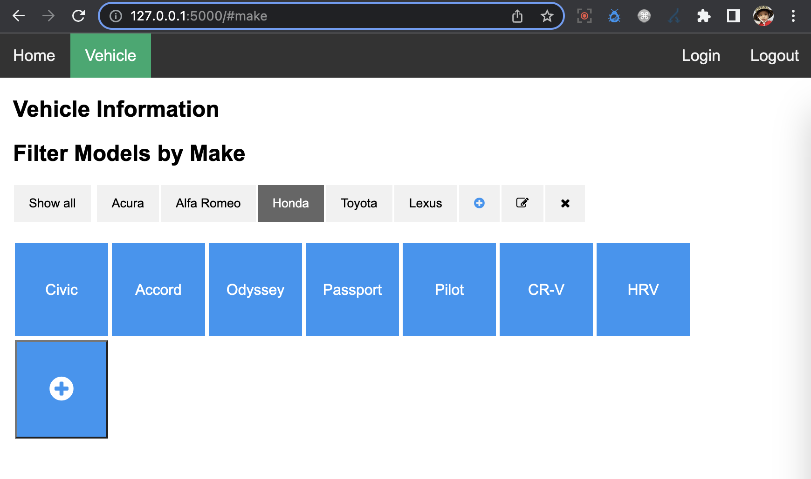
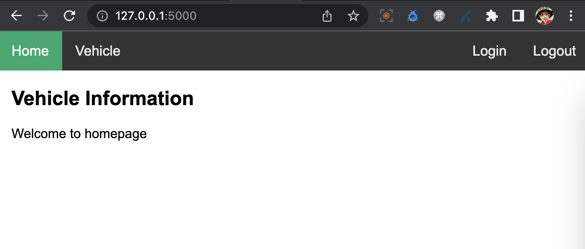
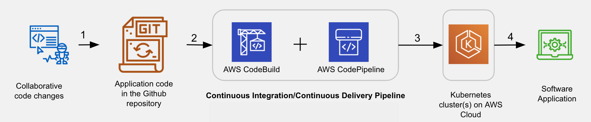
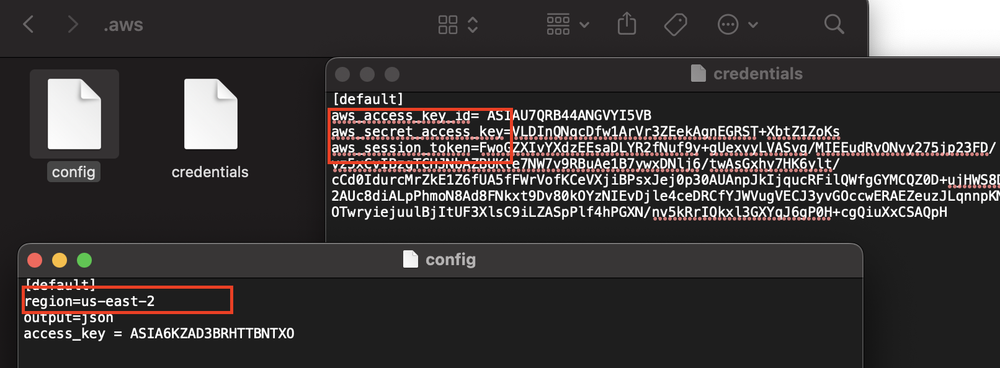
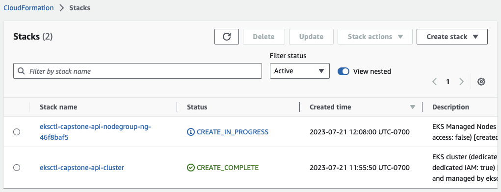
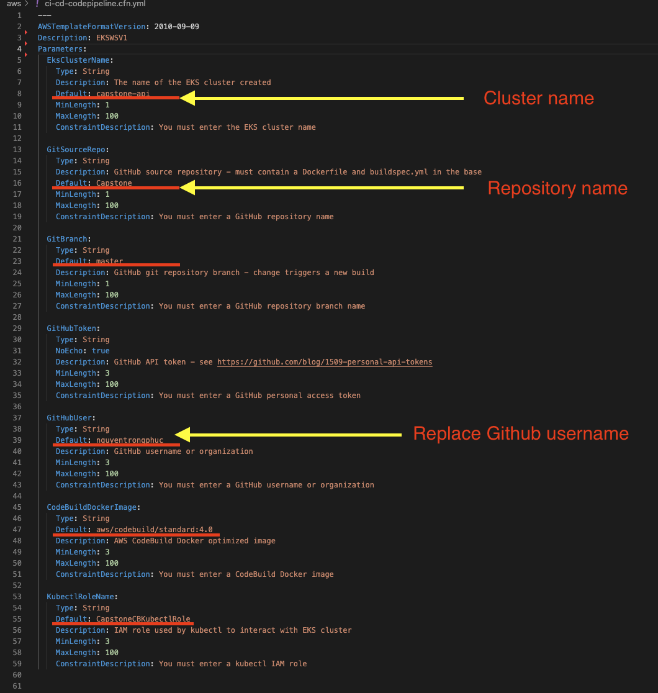
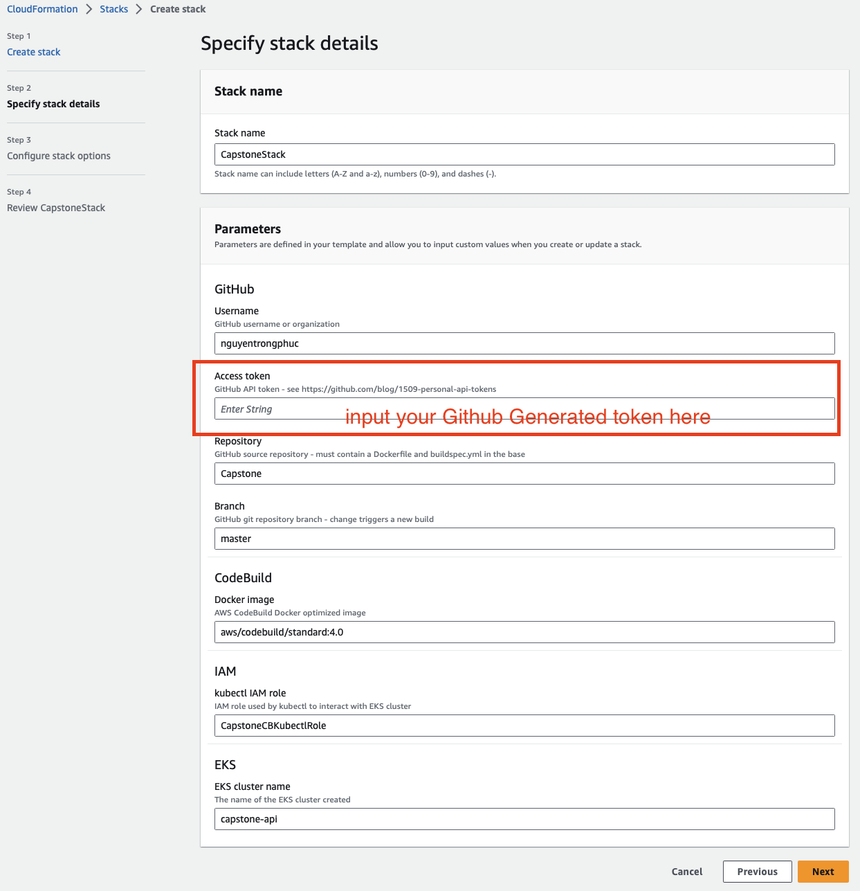

# Capstone - Table of Contents   
1. [Overview](#overview)
2. [Font End URL](#font-end-url)
3. [APIs Document](#apis-document)
4. [Postman](#postman)
5. [Project dependencies and Local development](#project-dependencies-and-local-development)
6. [Authentication](#authentication)
7. [AWS deployment instructions](#aws-deployment-instructions)
    7.1 [Prerequisite](#prerequisite)
    7.2 [Create EKS Cluster and IAM Role](#create-eks-cluster-and-iam-role)
    7.3 [Authorize the CodeBuild using EKS RBAC](#authorize-the-codebuild-using-eks-rbac)
    7.4 [Deployment to Kubernetes using CodePipeline and CodeBuild](#deployment-to-kubernetes-using-codepipeline-and-codebuild)


# Overview

Capstone is provide to view, add new, delete vehicles

- Add new Make or Model
- Modify existed Make
- Delete Make and Model



# Font End URL

http://a69e21d0efe8345ab95207dd2e1343c2-1886797275.us-east-2.elb.amazonaws.com/

In this app, we have 3 accounts with three different roles

- Admin account:
    + username: admin@gmail.com
    + password: P@ssw0rd
    + Admin role be able to reset to default the data only

- Manager account: 
    + username: manager@gmail.com
    + password: P@ssw0rd
    + Manager can do anything except reset data

- Dealer account:
    + username: dealer01@gmail.com
    + password: P@ssw0rd
    + Dealer can do anything except reset and delete data

Use the UI to login to get the token and we can use it in Postman as we as update it in Parameter store


# APIs Document

## MAKES 

### `GET '/makes'`

- General:
    + Fetches a list of makes
    + it should require the 'get:vehicles' permission
    + Request Headers:
        + Authorization: Bearer <Token>
- Returns: 
  + `success`: true if the data exist in database.
  + `total`: number of total makes
  + `makes`: An json object
  
- Sample: `CURL --header "Authorization: Bearer <Token>" http://127.0.0.1:5000/makes`

```json
{
    "makes": [
        {
            "id": 1,
            "models": [
                {
                    "id": 1,
                    "name": "Integra"
                },
                {
                    "id": 2,
                    "name": "MDX"
                },
                {
                    "id": 3,
                    "name": "ZDX"
                }
            ],
            "name": "Acura"
        },
        {
            "id": 2,
            "models": [
                {
                    "id": 4,
                    "name": "Giulia"
                },
                {
                    "id": 5,
                    "name": "Tonale"
                }
            ],
            "name": "Alfa Romeo"
        }
    ],
    "success": true,
    "total": 2
}
```

## MODELS 

### `GET '/models'`

- General:
    + Fetches a list of models
    it should require the 'get:vehicles' permission
    + Request Headers:
        + Authorization: Bearer <Token>
- Returns: 
  + `success`: true if the data exist in database.
  + `total`: number of total models
  + `makes`: An json object
  
- Sample: `CURL --header "Authorization: Bearer <Token>" http://127.0.0.1:5000/models`

```json
{
    "models": [
        {
            "id": 1,
            "makeName": "Acura",
            "name": "Integra"
        },
        {
            "id": 2,
            "makeName": "Acura",
            "name": "MDX"
        },
        {
            "id": 3,
            "makeName": "Acura",
            "name": "ZDX"
        },
        {
            "id": 4,
            "makeName": "Alfa Romeo",
            "name": "Giulia"
        },
        {
            "id": 5,
            "makeName": "Alfa Romeo",
            "name": "Tonale"
        }
    ],
    "success": true,
    "total": 5
}
```

## RESET DATA
### `GET '/resetdata'`

- General:
    + Reset to default data and Fetches a list of makes
    + it should require the 'admin' permission
    + Request Headers:
        + Authorization: Bearer <Token>
- Returns: 
  + `success`: true if the data exist in database.
  + `total`: number of total makes
  + `makes`: An json object
  
- Sample: `CURL --header "Authorization: Bearer <Token>" http://127.0.0.1:5000/resetdata`


## UPDATE MAKE
### `PATCH '/makes/<int:id>'`

- General:
    + Update Make
    + it should require the 'patch:vehicles' permission
    + Request Headers:
        + Authorization: Bearer <Token>
    + body: json
- Returns: 
  + `success`: true if the data be able to update into database.
  + `total`: number of total makes
  + `makes`: An json object
  
- Sample: `CURL -X PATCH --header "Authorization: Bearer <Token>" --d "{make: 'Honda'}" http://127.0.0.1:5000/makes/1`


## INSERT MODEL
### `POST '/models/<int:id>'`

- General:
    + Add new Make into model
    + it should require the 'post:vehicles' permission
    + Request Headers:
        + Authorization: Bearer <Token>
    + body: json
- Returns: 
  + `success`: true if the can insert new model in database.
  + `total`: number of total makes
  + `makes`: An json object
  
- Sample: `CURL -X POST --header "Authorization: Bearer <Token>" --d "{make: 'Civid'}" http://127.0.0.1:5000/models/1`


## DELETE MAKE
### `DELETE '/makes/<int:id>'`

- General:
    + delete make by id
    + it should require the 'delete:vehicles' permission
    + Request Headers:
        + Authorization: Bearer <Token>
- Returns: 
  + `success`: true if the can DELETE model in database.
  + `total`: number of total makes
  + `makes`: An json object
  
- Sample: `CURL -X DELETE --header "Authorization: Bearer <Token>" --d "{make: 'Civid'}" http://127.0.0.1:5000/makes/1`


# Postman
See detail at [here](src/backend/capstone.postman_collection.json)
```bash
.
├── DEALER SALE .
│       ├── /makes/
│       ├── /models/
│       ├── /makes/search
│       ├── /make/1/
│       └── .........
├── DEALER MANAGER
│       ├── /makes/
│       ├── /models/
│       ├── /makes/search
│       ├── /make/1/
│       └── .........
└── ADMIN
        └── /resetdata

```

# Project dependencies and Local development
## Prerequisite and project dependencies
- Docker desktop 
- Git
- Code editor (e.g. Visual Studio code)
- Postgres DB
- AWS Account
- Python and some library you can see [here](src/backend/requirements.txt)
- Termial or CMD

## Project structure (main files)

These are the files relevant for the current project:
```bash
.
├── Dockerfile
├── aws .
│       ├── auth
│       │       └── auth.py
│       ├── config
│       │       ├── prod.py
│       │       └── test.py
│       ├── aws-auth-patch.yml          # A sample EKS Cluster configMap file. 
│       ├── capstone_api.yml            # This is file that aws codebuild is using to create docker on EC2/POD/Node
│       ├── trust.json                  # TODO - Used for creating an IAM role for Codebuild
│       ├── iam-role-policy.json
│       └── ci-cd-codepipeline.cfn.yml  # TODO - YAML template to create CodePipeline pipeline and CodeBuild resources
├── src/backend.
│       ├── main.py	                    # APs and one endpoint for simple fontend
│       ├── test_main.py                # TODO - Unit Test file		
│       ├── capstone.postman_collection.json    # Postman Testing file		
│       └── requirements.txt
├── buildspec.yml                       # project builder
│
└── README.MD                           # documentation

```

## Steps to run the App Locally
The following steps describe how to run the Flask API locally with the standard Flask server, so that you can test endpoints before you containerize the app:

### 1. Install python dependencies
These dependencies are kept in a requirements.txt file in the root directory of the repository. To install them, go to the project directory that you’ve just downloaded, and run the command:
```bash
# Assuming you are in the Capstone/src/backend/ directory
pip install -r requirements.txt
```
### 2. Set up the environment
You will need the following two places available in your terminal environment:

- authentication environments places in [auth.py](src/backend/auth/auth.py)
    ```python
    ALGORITHMS = [os.environ.get('ALGORITHMS', 'RS256')]
    API_AUDIENCE = os.environ.get('API_AUDIENCE', 'phuc')
    AUTH0_DOMAIN = os.environ.get('AUTH0_DOMAIN', 'phucnguyen.us.auth0.com')
    AUTH0_CLIENT_ID = os.environ.get('AUTH0_CLIENT_ID', 'J804TumgtEPJ9Sr0MY6opWIu3SmgROM9')
    AUTH0_CALLBACK_URL = os.environ.get('AUTH0_CALLBACK_URL', 'http://127.0.0.1:5000/')
    ```
- database environments config place in [prod.py](src/backend/config/prod.py)

    ```python
    DB_HOST = os.environ.get('DB_HOST', '127.0.0.1:5432')  
    DB_USER = os.environ.get('DB_USER', 'postgres')  
    DB_PASSWORD = os.environ.get('DB_PASSWORD', 'P%40ssw0rd')    
    DB_NAME = os.environ.get('DB_NAME', 'vehicleinfo')  
    DB_PATH = 'postgresql+psycopg2://{}:{}@{}/{}'.format(DB_USER, DB_PASSWORD, DB_HOST, DB_NAME)
    ```

- notes: if you run with unit testing, the config place in [test.py](src/backend/config/test.py)


To add these to your terminal environment, run the following: 
```bash 
export ALGORITHMS='RS256' 
export API_AUDIENCE='phuc'
....

# Verify 
echo $ALGORITHMS 
echo $API_AUDIENCE
```

### 3. Run the app
Run the app using the Flask server, from the root directory of the downloaded repository, run:

```bash
# Assuming you are in the Capstone/src/backend/ directory
FLASK_APP=main.py FLASK_DEBUG=True flask run

# anothe way you can try to run 
python3 main.py

```

Open http://127.0.0.1:5000/ in a new browser - It will give you a response as


# Authentication
## Auth0 Authorization

- See detail on how to use and create an account with Auth0: https://auth0.com


## Using the Auth0 Authorization Code Flow with Hosted Login Pages
- You can see detail here: https://auth0.com/docs/api/authentication#authorize-application
```bash
https://{{YOUR_DOMAIN}}/authorize?audience={{API_IDENTIFIER}}&response_type=token&client_id={{YOUR_CLIENT_ID}}&redirect_uri={{YOUR_CALLBACK_URI}}
```

## Integrating Auth0 With Your Frontend

To integrate Auth0 with your frontend you simply need to redirect your user to your Auth0 hosted login page and include a url to redirect them to upon completion. This can be done using a simple html anchor link:

<a href="{{AUTH0_AUTHORIZE_URL}}">Login</a>

In this project we can build {{AUTH0_AUTHORIZE_URL}} as the code 

```python
def build_login_link(callbackPath = ''):
    link = 'https://'
    link += AUTH0_DOMAIN
    link += '/authorize?'
    link += 'audience=' + API_AUDIENCE + '&'
    link += 'response_type=token&'
    link += 'client_id=' + AUTH0_CLIENT_ID + '&'
    link += 'redirect_uri=' + AUTH0_CALLBACK_URL + callbackPath
    return link;

def build_logout_link(callbackPath = ''):
    link = 'https://'
    link += AUTH0_DOMAIN
    link += '/v2/logout?'
    link += 'audience=' + API_AUDIENCE + '&'
    link += 'client_id=' + AUTH0_CLIENT_ID + '&'
    link += 'returnTo=' + AUTH0_CALLBACK_URL + callbackPath
    return link;

```

# AWS deployment instructions

We are using CI/CD pipeline and Github repository


## Prerequisite

You must have the following:
- AWS CLI installed and configured using the aws configure command.
- The EKSCTL and KUBECTL command-line utilities installed in your system

Setup your local AWS Credentials



## Create EKS Cluster and IAM Role

### Create - Create an EKS cluster named "capstone-api” in a region of your choice:
```bash
eksctl create cluster --name capstone-api --nodes=2 --version=1.23 --instance-types=t2.medium --region=us-east-2
# Known Issue - If your default region is us-east-1, then the cluster creation may fail.
```

The command above will take a few minutes to execute, and create the following resources:
- EKS cluster
- A nodegroup containing two nodes.

### Verify - After creating the cluster, check the health of your clusters nodes:
Terminal
```bash
kubectl get nodes

phucnt33@LPP00192074C backend % kubectl get nodes
NAME                                           STATUS   ROLES    AGE     VERSION
ip-192-168-22-159.us-east-2.compute.internal   Ready    <none>   2m25s   v1.22.17-eks-0a21954
ip-192-168-52-151.us-east-2.compute.internal   Ready    <none>   2m25s   v1.22.17-eks-0a21954

```

AWS Console


## Create IAM Role for Code build
You will need an IAM role that the CodeBuild will assume to access your EKS cluster

### Get your AWS Account ID 
```bash
aws sts get-caller-identity --query Account --output text
# Returns the AWS account id similar to 
# 342559418112
```

### Update the trust.json file with your AWS account id.
```json
{
    "Version": "2012-10-17",
    "Statement": [
        {
            "Effect": "Allow",
            "Principal": {
                "AWS": "arn:aws:iam::<ACCOUNT_ID>:root"
            },
            "Action": "sts:AssumeRole"
        }
    ]
}
```


### Create a role, 'CapstoneCBKubectlRole', using the trust.json trust relationship:
```bash
### Assuming you are in the Capstone/aws directory
aws iam create-role --role-name CapstoneCBKubectlRole --assume-role-policy-document file://trust.json --output text --query 'Role.Arn'
# Returns something similar to 
# arn:aws:iam::342559418112:role/CapstoneCBKubectlRole
```

### Attach the iam-role-policy.json policy to the 'UdacityFlaskDeployCBKubectlRole' as:
```bash
### Assuming you are in the Capstone/aws directory
aws iam put-role-policy --role-name CapstoneCBKubectlRole --policy-name eks-describe --policy-document file://iam-role-policy.json
```

## Authorize the CodeBuild using EKS RBAC
### Fetch - Get the current configmap and save it to a file
```bash
### Assuming you are in the Capstone/aws directory
# Mac - I want to save aws-auth-patch.yml in <current_directory>/tmp/aws-auth-patch.yml
kubectl get -n kube-system configmap/aws-auth -o yaml > ./tmp/aws-auth-patch.yml
```

### Edit - Open the aws-auth-patch.yml file using any editor, such as VS code editor:
Add the following group in the data → mapRoles section of this file. YAML is 
indentation-sensitive, therefore refer to the snapshot below for a correct indentation:
```yml
    - groups:
        - system:masters
        rolearn: arn:aws:iam::<ACCOUNT_ID>:role/UdacityFlaskDeployCBKubectlRole
        username: build  
```
look at this sample Capstone/aws/aws-auth-patch.yml file 


### Update - Update your cluster's configmap:
```bash
# Mac/Linux
# ### Assuming you are in the Capstone/aws directory
kubectl patch configmap/aws-auth -n kube-system --patch "$(cat ./tmp/aws-auth-patch.yml)"

# The command above must show you as response as:
# configmap/aws-auth patched
```

## Deployment to Kubernetes using CodePipeline and CodeBuild

### Generate a Github access token
Generate GitHub Access Token with full control of private repositories

Once you create a personal access token, you can share this with any service (such as AWS CloudFormation) to allow accessing the repositories under your Github account.


### Create Postgres DB
- Using AWS Console 
- Go to RDS service and create Postgres DB
- Chooses:
    + Esay Create
    + PostgresSQL
    + Free Tier
    + DB instance identifier: vehicleinfo
    + username/password: postgres
    + Don't connect to an EC2 compute resource (we may connect it later)

- After complete, modify Postgress db choose
    + Publicly accessible

### Create Codebuild and CodePipeline resources using CloudFormation template
#### Modify the template
Modify file `Capstone/aws/ci-cd-codepipeline.cfn.yml`


#### Create Stack based on the template above
Using AWS Console to create stack


### Save variables in AWS Parameter Store
```bash

aws ssm put-parameter --name ALGORITHMS --overwrite --value "RS256" --type String
aws ssm put-parameter --name AUTH0_DOMAIN --overwrite --value "phucnguyen.us.auth0.com" --type String
aws ssm put-parameter --name API_AUDIENCE --overwrite --value "phuc" --type String
aws ssm put-parameter --name AUTH0_CLIENT_ID --overwrite --value "J804TumgtEPJ9Sr0MY6opWIu3SmgROM9" --type String
aws ssm put-parameter --name AUTH0_CALLBACK_URL --overwrite --value "<API_PUBLIC_IP>" --type String
aws ssm put-parameter --name DB_HOST --overwrite --value "<POSTGRES_ENDPOINT>:5432" --type String
# for example aws ssm put-parameter --name DB_HOST --overwrite --value "vehicleinfo.ctrhryqdkzdy.us-east-2.rds.amazonaws.com:5432" --type String

aws ssm put-parameter --name DB_USER --overwrite --value "postgres" --type String
aws ssm put-parameter --name DB_PASSWORD --overwrite --value "postgres" --type String
aws ssm put-parameter --name DB_NAME --overwrite --value "vehicleinfo" --type String

aws ssm put-parameter --name TOKEN_DEALER --overwrite --value "<token>" --type String
aws ssm put-parameter --name TOKEN_DEALER_MANAGER --overwrite --value "<token>" --type String


#NOTE: we may revist later for update DB_HOST and AUTH0_CALLBACK_URL
#Verify
aws ssm get-parameter --name AUTH0_DOMAIN
``

aws ssm put-parameter --name AUTH0_CALLBACK_URL --overwrite --value "vehicleinfo.ctrhryqdkzdy.us-east-2.rds.amazonaws.com:5432" --type String


